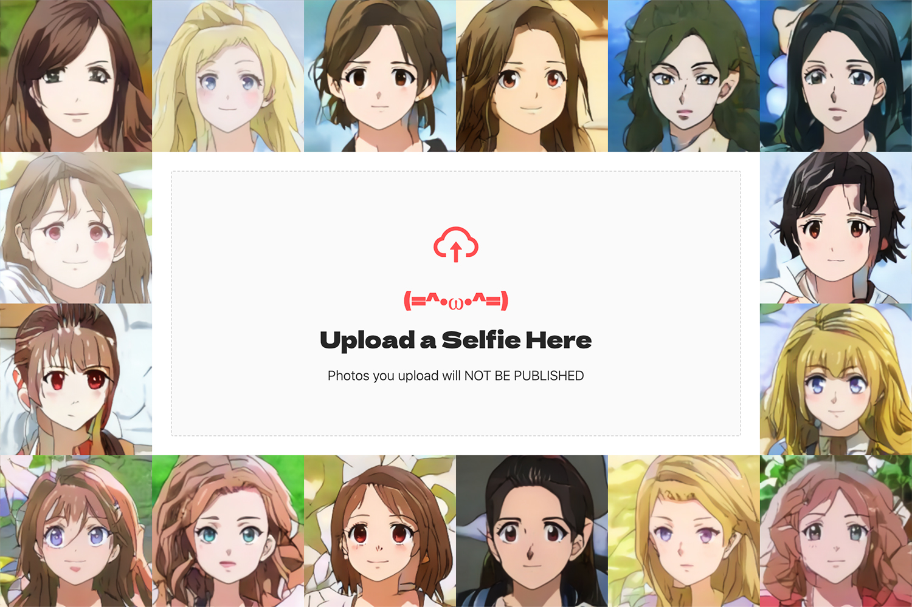

# deep-waifu-nft-astar

This is a part of the [DeepWaifu](https://blog.chronologic.network/no-waifu-no-laifu-we-use-deep-networks-to-draw-your-anime-style-portrait-5fbb0ee6b16a) project.

This repository holds the smart contract that handles payments and minting of the DeepWaifu NFTs.

The live version of the dapp can be found [here](https://deepwaifu.ai/).

## 🗺 Project overview

This project consists of the following repositories:

- https://github.com/chronologic/deep-waifu-ui-astar
- https://github.com/chronologic/deep-waifu-server-astar
- https://github.com/chronologic/deep-waifu-nft-astar (this repository)
- https://github.com/chronologic/deep-waifu-model

## 👀 Demo video

## 🔧 Environment variables

This repo uses [`dotenv`](https://www.npmjs.com/package/dotenv) to load environment variables.

For development, an `.env` file should be created based on the `.env.example` template file. The `.env` file should never be commited.

In production, environment variables can be injected directly.

Below is a list of possible environment variables.

| Name          | Type     | Description                                                  |
| ------------- | -------- | ------------------------------------------------------------ |
| `PRIVATE_KEY` | `string` | Private key for the wallet that will be used for deployment. |

## 💽 Installation

Run `npm install`

## 🚧 Building

Run `npm run compile`

## 📊 Testing

Run `npm run test`

## 🔗 Deployment

Run `npm run deploy:<chain>` where chain can be `localnet`, `shibuya` or `shiden`.
